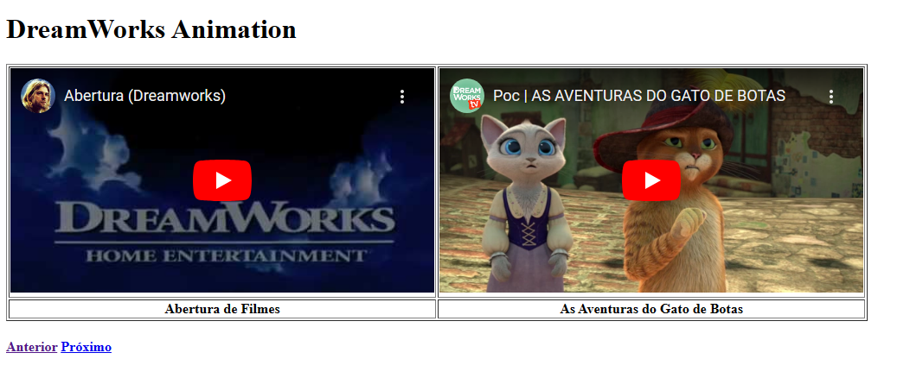
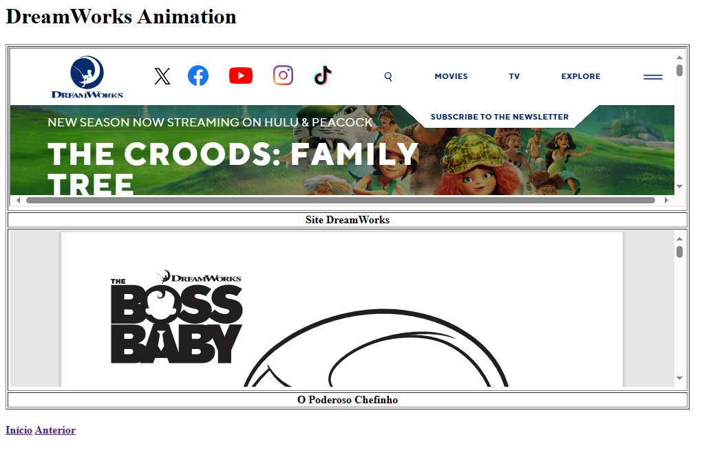

# atividadeHTML-Dreamworks
uma das primeiras atividades de HTML feita em aula. html da dreamworks para aprender mais alguns elementos de html.
  

  <h3>Um dos primeiros projeto de HTML que usamos imagens.</h3>
  

  

  <h3>Também aprendemos como trazer vídeos do youtube para a página.</h3>
  

  

  <h3>Também aprendemos a trazer outras páginas para a nossa página.</h3>
  

